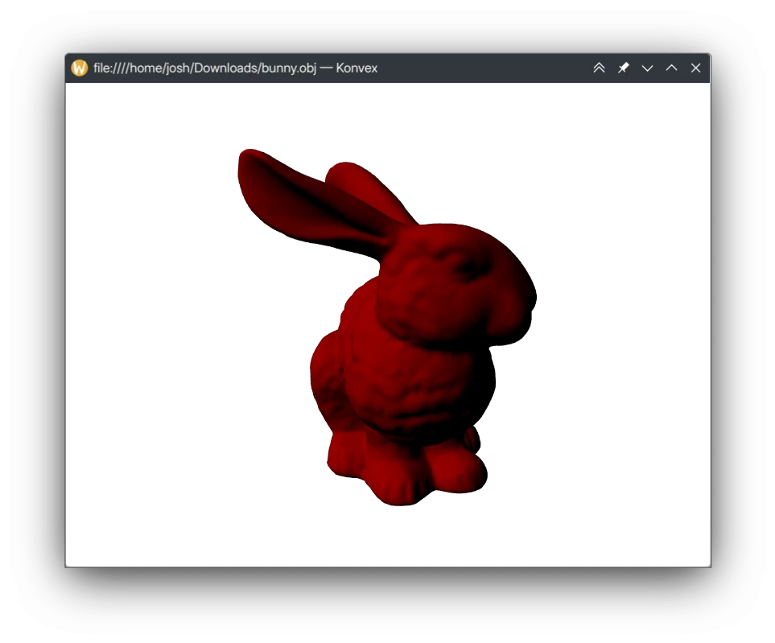

# Konvex

A simple 3D model viewer for KDE.



## Features

* Can load
  all [the formats supported by Assimp](https://github.com/assimp/assimp/blob/master/doc/Fileformats.md).
  Popular file formats include OBJ, FBX and glTF.

This utilizes the Qt Quick 3D library, which does all of the heavy lifting for
rendering, input, etc.

## Get It

Builds are available for Fedora users through
my [personal COPR](https://copr.fedorainfracloud.org/coprs/redstrate/personal/):

```shell
sudo dnf copr enable redstrate/personal 
sudo dnf install konvex
```

## License


This project is licensed under the GNU General Public License 3. The logo was
done by Bugsbane and licensed under
CC-BY-4.0.
